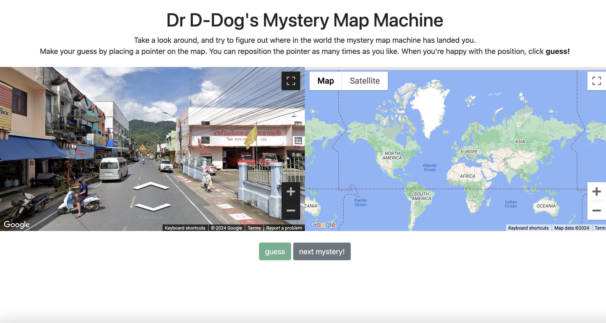
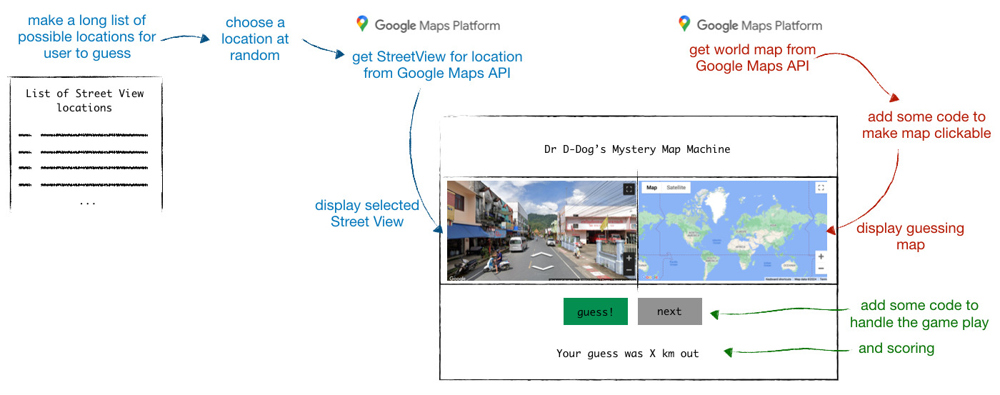
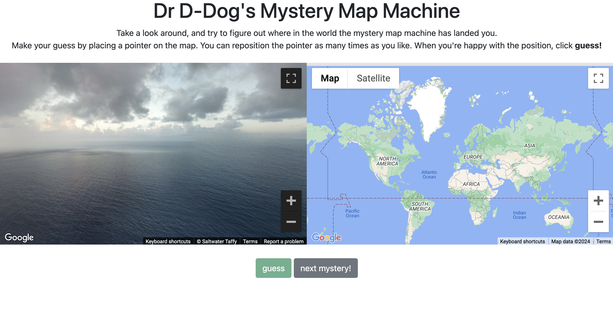

# Dr D-Dog's Mystery Map Machine

## Why I made this

In a fit of cringe-inducing nerdery, my husband Ed and I decided to make each other digital games for Valentine's Day. Really, it had spun out of a conversation about the game [GeoGuessr](https://www.geoguessr.com/), and how difficult it might be to build your own version. I wanted to give it a go; all the better if I had an excuse to do it.

The premise of GeoGuessr is simple: you are uncerimoniously plopped in a random location somewhere on Earth, and must determine where you are only through the clues that Google Street View can provide. You interrogate the street signs, the architecture, the flora - you soon develop tactics - then click on a map to make your guess. The closer your guess to the actual location, the better your score. 

At first I had grand, romantic plans to create multiple versions of the game - a regular one, where Ed saw random Street Views and had to pan down a desolate highway or unfamiliar town centre until he finally got to a street sign or roadside stop that gave him more of a clue - and a romantic one, where he'd see the beaches, streets, restaurants and metal waste dumps[^1] that have been formative backdrops to our nine-year relationship. I never ended up making the romantic version, partly because I realized that as a game, it would be deeply boring as he'd know exactly where each of those locations were, and partly because I ran out of time before Valentine's Day.

## How I made it

Here's a basic sketch of how I figured the thing should work:

Displaying the selected Street View and making an interactive, clickable world map was pretty straightforward, because the APIs are, as you might expect, extremely well documented. 

More challenging was figuring out what Street View locations I was going to use, and making the potential set of locations. After poking around a bit, two things were clear:

* To get a Street View of a given location, you need the longitude and latitude of that location.

* For any given longitude and latitude, it's not necessarily the case that there'll be a Street View image for that location. (For example, even if you know the longitude and latitude of a street in Pyongnang, you're not gonna be able to cruise around North Korea via Street View).

This suggested that I'd probably want to construct a list of potential longitude and latitude coordinates, and then check whether there was a Street View image for each. And I probably wouldn't want that checking to be done 'live' - i.e., while the user was playing the game - because it could take a little while to get a location with a Street View image, especially if checking a very long list with a ton of dud coordinates. Imagine having to check 5000 coordinates before being able to play a single round, with the user just sat in front of a loading screen? 

So - here's what I did:

1. I found a list of longitude and latitude coordinates for approximately 47k world cities from the [Basic World Cities Database](https://simplemaps.com/data/world-cities) 
2. I used the [Wikipedia article on Google Street View coverage](https://en.wikipedia.org/wiki/Google_Street_View_coverage) to figure out which countries Google Street View covers. After all, there's no point checking if a list of coordinates in Pyongnang have Street Views if you know that there's no coverage of North Korea whatsoever.  I removed all entries for countries that aren't covered from my list of coordinates. I made other edits, too; for example, apparently China only has coverage in touristy places, so I included only the most touristy cities. 
3. This left me with a slimmed-down list of approximately 34k candidate coordinates. To check whether each of these had a corresponding Street View, I used the Google Street View API to check whether ther was metadata associated with the coordinates - the presence of metadata indicating that there was indeed a Street View. 

And, ta da! A list of around 21k locations resulted. And given that the game was designed for a single user, that seemed like probably enough rounds of the game to be getting on with. 

### Quirks

* I realized while testing the game that some countries feature heavily - either due to Google Street View having extremely dense coverage, with what seems like almost every street mapped (e.g., the UK) ,or because the countries themselves are so enormous (e.g., Brazil), or both (e.g. the US). It can get quite boring seeing similar streets over and over again, so perhaps it would be worth sampling more heavily from underrepresented places, and vice versa.

* Also - given the initial source data (coordinates for world *cities*), a player will more often find themselves in busy city centres rather than desolate highways. Which I think is fun, because there's more to look at, but probably makes the game easier. 

* I didn't realize while building the game, but some of the locations aren't Street Views per se, but panoramic photos. I think it would be easy enough to prevent it, but doing so would be a shame because it gives rise to some delightful results, like this:

  

  It also means that sometimes you find yourself in the interior of a restaurant, or bathroom show room, or school.

## Play the game!

If you want to play, you can download the **play_game** folder in this repo; open index_public.html to access the game. You will however need your own Google Maps API key: [get one here](https://developers.google.com/maps/documentation/javascript/get-api-key) and replace *INSERT_KEY_HERE* (line 39 of index_public.html) with your key. 

[^1]: The less said about this, the better.